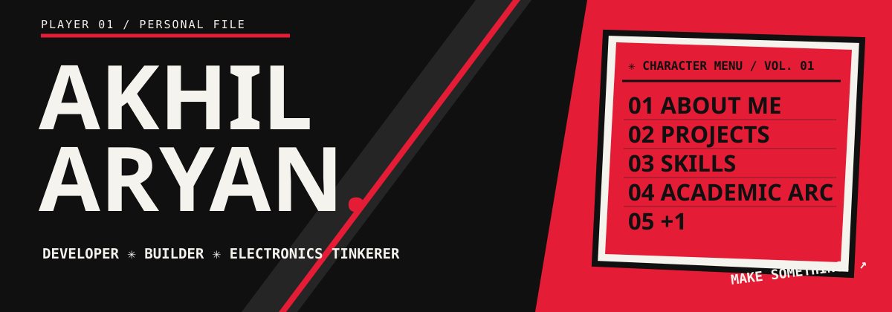

<p align="center"></p>

# AKHILARYAN / Character Menu

**A personal portfolio disguised as a playable RPG menu.** It explores code, electronics, unfinished experiments, and an academic arc that refuses to pretend progress is a straight line.

[Live site](https://akhilaryan-character-menu.akhilaryan.chatgpt.site) · **React** · **Vite** · **Framer Motion** · **Web Audio API**

> The live site is currently private to the owner. The source runs locally with the commands below.

## What is inside?

- **Character menu:** Seven selectable files instead of a conventional navbar. Hover, click, or use the keyboard.
- **About Me:** A character dossier with interests, location, and an original lettermark placeholder for a portrait.
- **Projects:** Mission-style entries for the ISS tracker, ESP32 quadcopter experiment, Arduino music display, and gesture interface. Each opens its own detail screen. Only verified links are active.
- **Skills:** Clickable software, hardware, and tool abilities without percentage bars.
- **Experience:** Comic panel build log.
- **Academic Arc:** Twelve scenes about expectations, wrong answers, uneven progress, debugging one mistake, good days, bad days, and unsolved questions. Explore the desk, collect tiny XP wins, and choose whether to try one more question or call it a day.
- **+1:** A deliberately imperfect ending about continuing to learn and make things.
- **Contact:** A simpler, red finale with a GitHub link. Email and Instagram remain unlinked until real details are added.

### Original music

There are **19 different procedural arrangements**: the menu, portfolio sections, and every scene in the Academic Arc each has its own variation. Synthesized menu, save, XP, impact, and discovery effects react to choices. All music is generated in the browser by `src/audio.js`; there are no sampled tracks or copied game themes.

Audio starts only after pressing **SOUND ON**. Visitors can mute it and adjust the volume. The UI also respects reduced-motion preferences.

## Run it

Requires a recent version of Node.js and npm.

```bash
npm ci
npm run dev
```

Open the local address printed by Vite. To check the production build:

```bash
npm run build
npm run preview
```

No API keys or environment variables are needed.

## Controls

| Input | Action |
| --- | --- |
| Click or tap | Select a menu item, project, ability, or object |
| `↑` / `↓` | Change the selected item in the main menu |
| `Enter` | Open the selected menu item |
| `1`–`7` | Jump to a section while focus is outside a control |
| `Esc` | Return to the main menu or close a project detail screen |
| Scene diamonds / Previous / Next | Move between Academic Arc scenes |
| Sound button + slider | Start or mute music and adjust volume |

## Project structure

```text
src/
  main.jsx          Menu, portfolio sections, project details, navigation
  AcademicArc.jsx   Twelve interactive scenes and the +1 chapter
  audio.js          Original Web Audio music and sound effects
  style.css         Main comic / RPG visual system
  academic.css      Academic Arc and +1 styling
public/
  favicon.svg       Original monogram
docs/
  banner.svg        Original README artwork
```

## Make it yours

Project descriptions and verified URLs live in the `projects` array in `src/main.jsx`. The menu text, biography, and links are in the same file. Academic scene dialogue and interactions live in `src/AcademicArc.jsx`. Adjust tempos and note patterns in `src/audio.js`.

The source includes a typographic portrait placeholder; no photo is needed to run it. GitHub is the only linked social destination at the moment. The academic graph is an illustration of how progress *feels*, not a chart of real grades.

## Design notes

The artwork is original and built from typography, CSS geometry, and SVG. The limited black, off-white, and crimson palette borrows the **energy** of manga, punk zines, and RPG menus without using game characters, logos, or screenshots. Motion is fast and deliberate; mobile effects are simplified.

Built by **Akhilaryan**. Work in progress, as intended.
